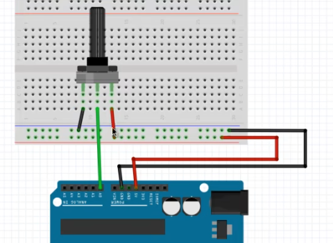

## analogRead



```c++
int analogInputVal=analogRead(A0);
```

将0-5V电压输入信号映射到0-1023

读取的最大频率是每秒10000次

可以用ana

arduino的randomSeed可以用analogRead读取一个空引脚作为**随机种子**

```c++
analogRead(pin);
```

2024.4.9