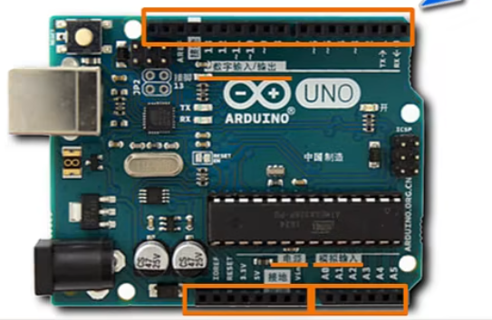

## 基本硬件

### 开源硬件

官方板和第三方板

### 端口

* 数字输入输出端口 digital

    * 对于数字端口，信号只有0和1

    * 在数字输入输出端口中，有两个端口比较特殊: 端口1、端口0[tx,rx]，可以用来和电脑传输数据

        * 实在没有办法了再用这两个端口

    * 13号引脚上有一个LED

* 模拟输入端口 analog in

* 电源 power

    * GND

    * 5V

    * 3.3V

2024.4.6
