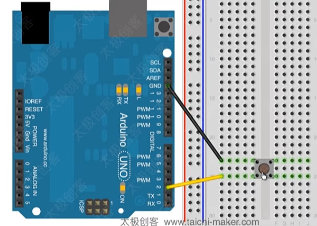

## 通过开关控制LED

### 输入上拉模式INPUT_PULLUP

arduino自带内部上拉电阻，如果需要使用这个上拉电阻，需要将引脚模式设为INPUT_PULLUP模式

当arduino引脚处于INPUT模式时，不能输入负压，会损坏

注意上拉模式的开关是反的，开关闭合低电平，开关断开高电平

### 电路



### 程序

```c++
void setup()
{
    Serial.begin(9600);

    pinMode(2,INPUT_PULLUP);
    pinMode(13,OUTPUT);
}

void loop()
{
    int sensorVal=digitalRead(2);
    Serial.println(sensorVal);

    if(sensorVal==HIGH)
    {
        digitalWrite(13,LOW);
    }
    else
    {
        digitalWrite(13,HIGH)
    }
}
```

2024.4.7
