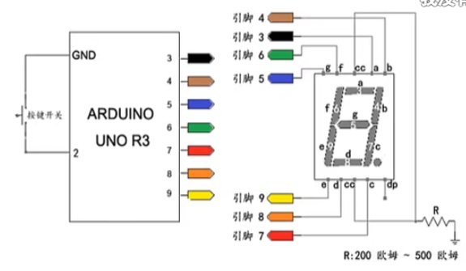
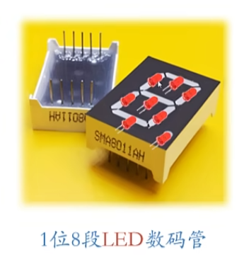
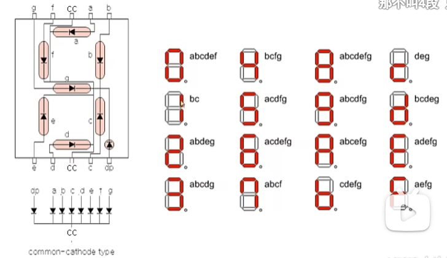

## Random Number Device

### 电路搭建



### LED数码管





cc需要通过**电阻**接地，共阴极

### 程序

```c++

void clear()
{

    digitalWrite(3,LOW);
    digitalWrite(4,LOW);
    digitalWrite(5,LOW);
    digitalWrite(6,LOW);
    digitalWrite(7,LOW);
    digitalWrite(8,LOW);
    digitalWrite(9,LOW);

}

void setup()
{

    pinMode(3,OUTPUT);
    pinMode(4,OUTPUT);
    pinMode(5,OUTPUT);
    pinMode(6,OUTPUT);
    pinMode(7,OUTPUT);
    pinMode(8,OUTPUT);
    pinMode(9,OUTPUT);

}

void loop()
{

    // display 1
    digitalWrite(4,HIGH);
    dititalWrite(7,HIGH);
    delay(500);
    clear();
    
    // display 2
    digitalWrite(3,HIGH);
    digitalWrite(4,HIGH);
    digitalWrite(5,HIGH);
    digitalWrite(8,HIGH);
    digitalWrite(9,HIGH);
    delay(500);
    clear();

    // display 3
    digitalWrite(3,HIGH);
    digitalWrite(4,HIGH);
    digitalWrite(5,HIGH);
    digitalWrite(7,HIGH);
    digitalWrite(8,HIGH);
    delay(500);
    clear();

}

```

### switch case

```c++
switch (var)
{
    case 1:
        ...
        break;
    case 2:
        ...
        break;
    ...
    default:
        ...
        break;
}
```

### 产生随机数

```c++
int myNumber=random(0, 4); 
```

2024.4.7