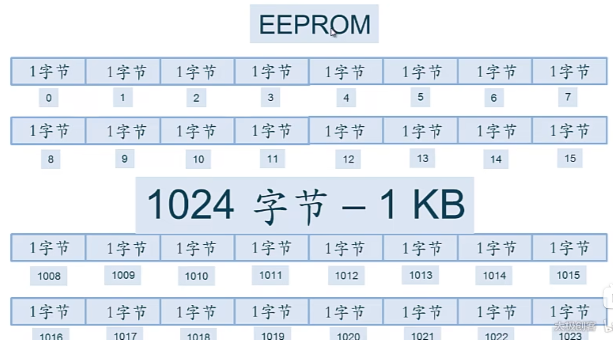

## EEPROM

如何向EEPROM写入数据?如何从EEPROM读取数据?

### 储存结构

一个巨大无比的一维数组，每一格存一个字节，拥有一个编号

一共可以存储1024个字节（1KB）



注意每个字节是8位，可以存放一个0-255的数值

EEPROM一共可以存放1024个0-255的十进制数字

### 向EEPROM写入数据

```c++
EEPROM.write(0,123);
```

```c++
#include <EEPROM.h>

int addr=0;

void setup()
{
    // nothing
}

void loop()
{
    int val=analogRead(0)/4; // 模拟输入引脚是0-1024
    EEPROM.write(addr,val);

    addr=addr+1; // 内存移位
    if(addr==EEPROM.length())
    {
        addr=0;
    }

    delay(100); // 写完数据后都要等一会，写EEPROM比较久
}
```

### 从EEPROM读取数值

```c++
value=EEPROM.read(address);
```

### 更多参考

http://www.taichi-maker.com/homepage/reference-index/arduino-library-index/

对于超出0-255范围的数据，可以用 ```EEPROM.get()``` 和 ```EEPROM.put()``` 进行读写

2024.4.13