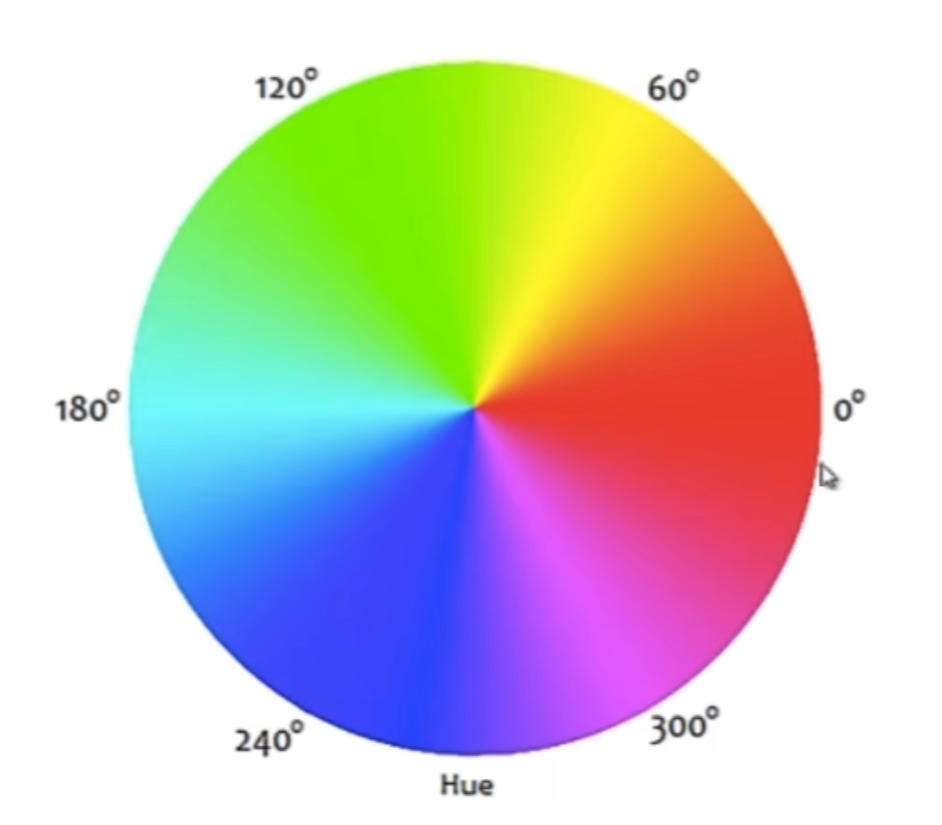
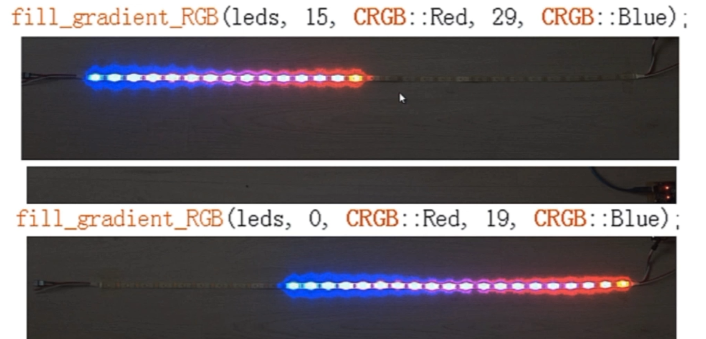
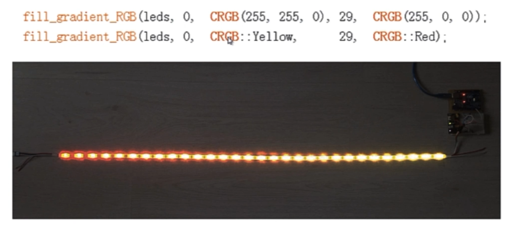
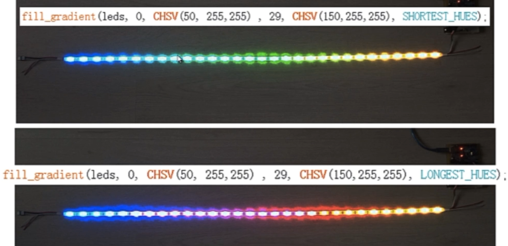

## FastLED

### 效果1

控制第一个灯闪烁红色

```c++
#include "FastLED.h"

#define NUM_LEDS 30
#define DATA_PIN 9
#define LED_TYPE WS2812
#define COLOR_ORDER RGB

uint8_t max_bright=128; // 控制光带的最大亮度
// uint8_t类型的取值范围为0-255

CRGB leds[NUM_LEDS]; // 建立LED灯带对象

void setup()
{
    Serial.begin(9600);
    delay(1000);

    // 初始化光带
    LEDS.addLeds<LED_TYPE,DATA_PIN,COLOR_ORDER>(leds,NUM_LEDS);

    FastLED.setBrightness(max_bright);
}

void loop()
{
    leds[0]=CRGB::Red; // 设置光带第一个灯珠为红色
    FastLED.show(); // 更新LED色彩
    delay(500);

    leds[0]=CRGB::Black; // 灭了
    FastLED.show();
    delay(500);
}
```

稍加修改就可以每个灯珠依次闪烁（跑马灯）

```c++
...
void loop()
{
    for(int i=0;i<=NUM_LEDS;i++)
    {
        leds[i]=CRGB::Red; // 设置光带第一个灯珠为红色
        FastLED.show(); // 更新LED色彩
        delay(50);

        leds[i]=CRGB::Black; // 灭了
        FastLED.show();
        delay(50);
    }
    delay(500);
}
```

### 效果2-fill_solid

所有灯带一起点亮熄灭闪烁

```fill_solid```用于将从起点到终点的灯珠设置为单一颜色

```c++
void loop()
{
    fill_solid(leds,30,CRGB::Red);
    FastLed.show();
    delay(500);

    fill_solid(leds,30,CRGB::Black);
    FastLed.show();
    delay(500);
}
```

```c++
fill_solid(leds,3,CRGB::Red);
```

```c++
fill_solid(leds+5,3,CRGB::Red);
```

数组名相当于数组首位的地址

### 效果3-自定义颜色

#### RGB

```c++
...
CRGB myColor(50,0,50);
...
myColor.r=0;
fill_solid(leds,NUM_LEDS,myColor);
```

#### HSV

```c++
CHSV myColor=(80,255,200); // 色相 饱和度 亮度
fill_solid(leds,NUM_LEDS,myColor);
```



```c++
void loop()
{
    myColor.h++;
    fill_solid(leds,NUM_LEDS,myColor);
    FastLED.show();
    delay(50);
}
```

### 效果4-fill_rainbow

```fill_rainbow``` 彩虹填充

* 第三个参数是HSV色环的起始位置

* 第四个参数指定每个灯珠之间的HSV差值

```c++
fill_rainbow(leds,30,0,1);
```

### 效果5-fill_gradient

渐变填充

```c++
fill_gradient_RGB(leds,0,CRGB::Red,29,CRGB::Blue);
// 光带对象，起始灯珠号，起始RGB色彩，结束灯珠号，结束RGB色彩
```





csv类型颜色可以用fill_gradient

```c++
fill_gradient(leds,00,CHSV(50,255,255),28,CHSV(150,255,255),SHORTEST_HUES);
```

