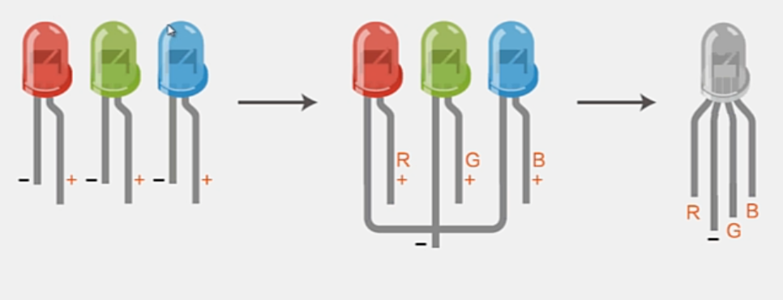
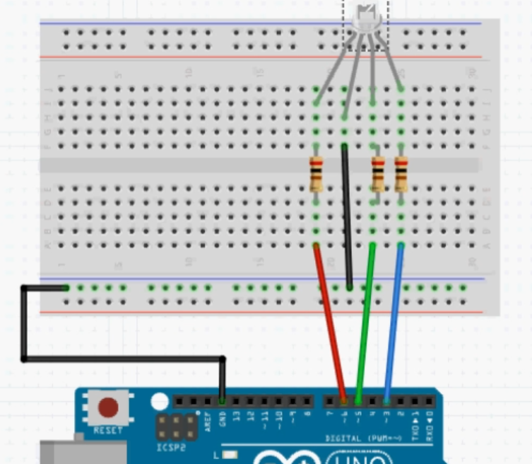

## RGB LED




### 接线



### 程序

作用：

发送指令 ex ```r128g100b20``` 改变LED颜色

```c++
const int rLedPin=6;
const int gLedPin=5;
const int bLedPin=3;

int ledR=0;
int ledG=0;
int ledB=0;

void setup()
{
    pinMode(rLedPin,OUTPUT);
    pinMode(gLedPin,OUTPUT);
    pinMode(bLedPin,OUTPUT);

    Serial.begin(9600);
    Serial.println("Please input rgb value:");
}

void loop()
{
    if(Serial.available()>0)
    {
        char serialCmdChar=Serial.read();
        serialCmd(serialCmdChar);
    }
    delay(50);
}

void serialCmd(char serialCmdChar)
{
    switch(serialCmdChar)
    {
        case 'r':
            ledR=Serial.parseInt();
            break;
        
        case 'g':
            ledG=Serial.parseInt();
            break;

        case 'b':
            ledB=Serial.parseInt();
            break;

        case 'c':
            ledG=0;
            ledB=0;
            ledR=0;
    }

    analogWrite(rLedPin,ledR);
    delay(100);
}
```


2024.4.11