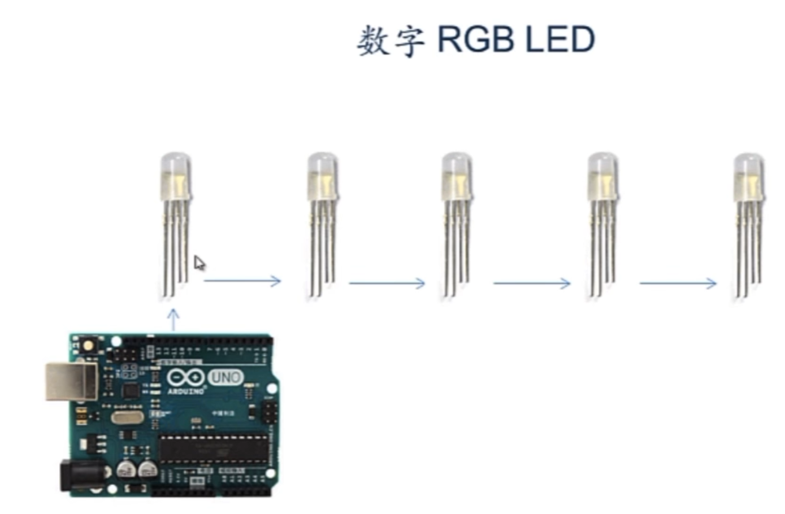
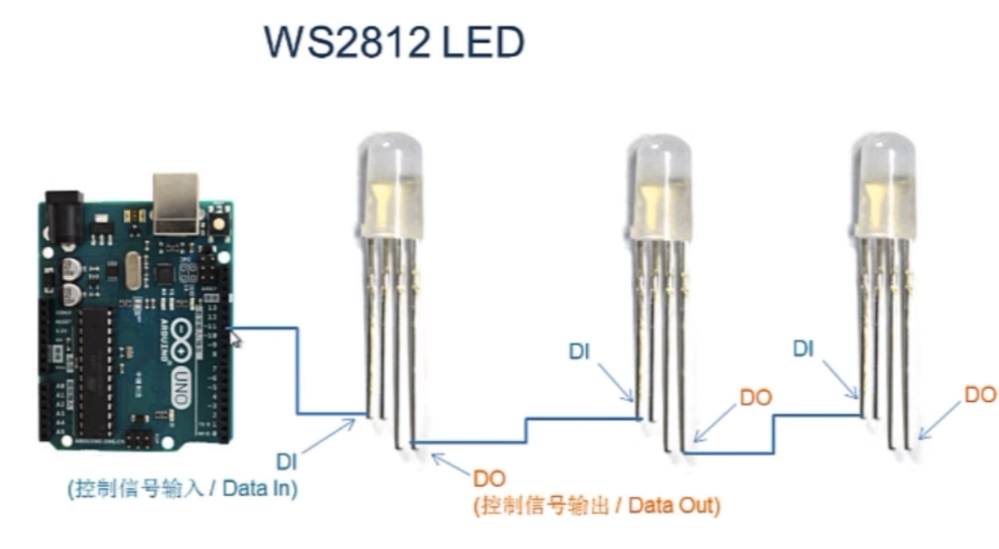
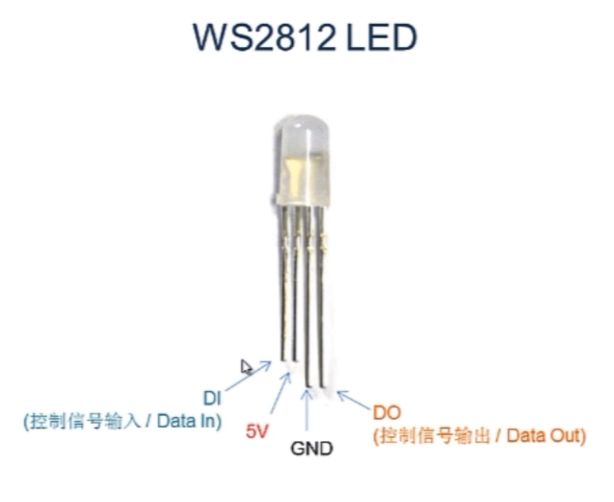
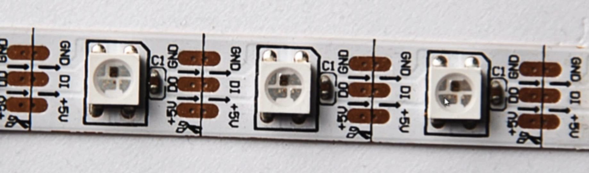
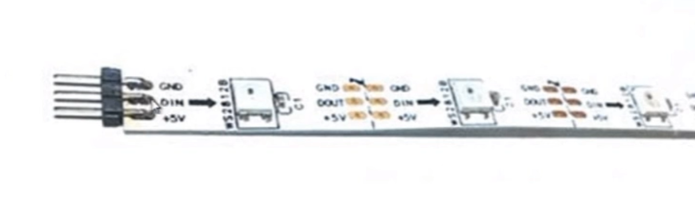
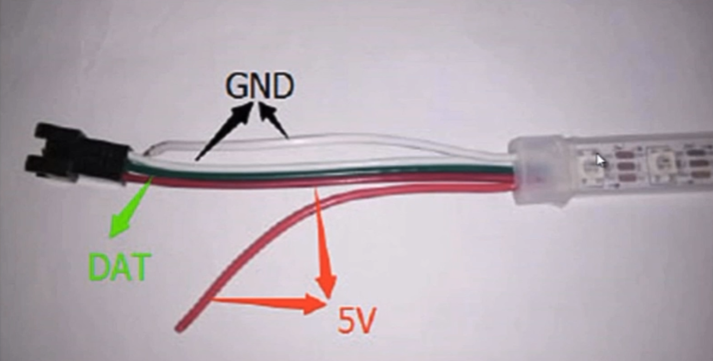
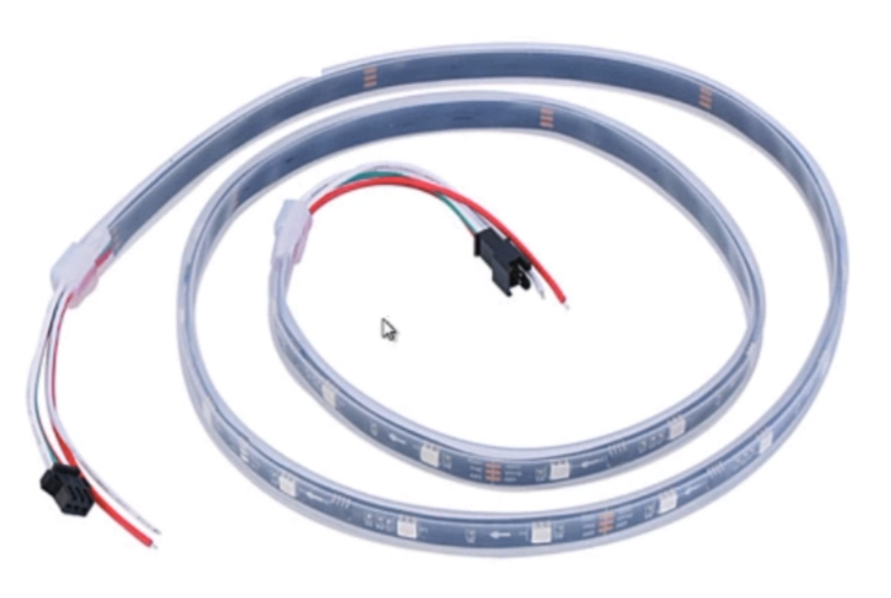

## WS2812

### 数字RGBLED

将控制芯片分装在LED灯珠内

将多个这样的数字LED串联即可得到一个灯带

### WS2812

上面文字的含义

* 箭头 ： 信号流方向

* 椭圆形铜片 ： 信号输入输出&正负极引脚

* 铜片上的黑线 ： 切割线

剪短后焊接上插针即可使用

#### 默认引脚分布

可以多根首尾相接使用

#### 规格

* 每米多少个灯

* 裸板 滴胶

也有焊接在硬质电路板上的、圆环形的、以及点阵

2024.4.14