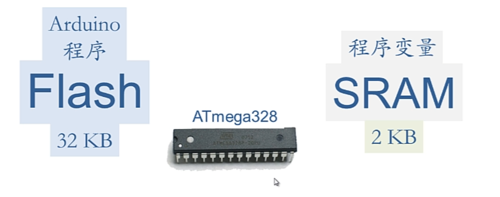

## 优化内存使用



如何优化Flash和SRAM内存使用

### 优化SRAM

* 将常量字符串等放到Flash

```c++
Serial.println(F("Hello World"));
```

* 将常量放到Flash

```c++
const int PROGRAM a=125;
```

* 以局部变量代替全局变量

    * 局部变量在函数调用完毕后即弹出

* 尽量使用占用内存少的数据类型

    * 各种数据类型所占用的空间：[传送门](http://www.taichi-maker.com/homepage/reference-index/arduino-code-reference/data-types/)

    * 0-255之间的数可以用```byte```类型来存放

### 优化Flash

* 代码简洁

* 删除无用代码

    * 删除无用库

    * 删除无用变量

    * 删除无用函数

2024.4.13