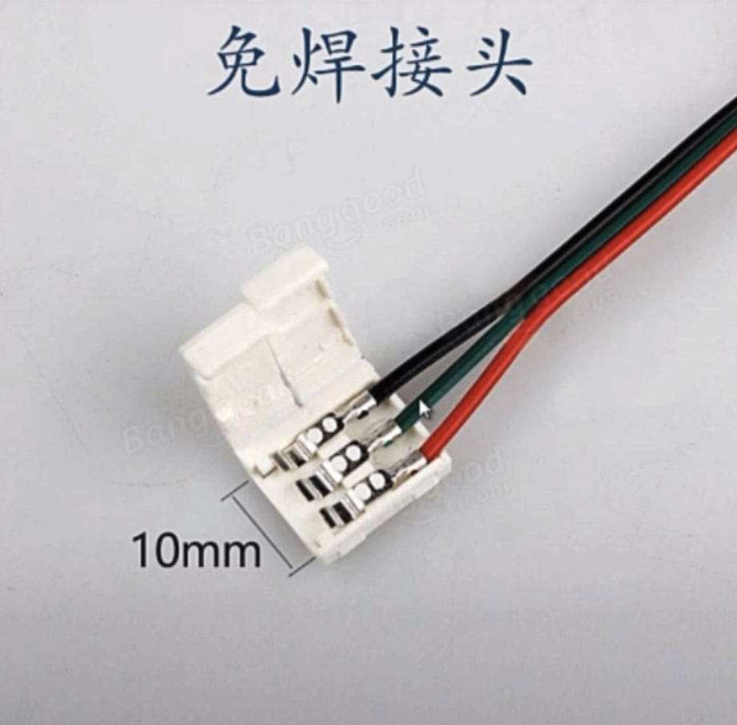

## arduino控制WS2812

### 接线

#### 方法1

#### 方法2

开发时

记得共地

最后使用时，通过arduino的5V引脚给arduino供电

##### arduino供电

http://www.taichi-maker.com/homepage/arduino-projects-index/arduino-power-supply/

### 电流计算

每个WS2812灯珠消耗60mA

电流向下兼容

### 灯带连接

#### 杜邦线连接

#### 免焊接头

#### 焊接接头

将插针焊接到灯带上，再接入电路

2024.4.14