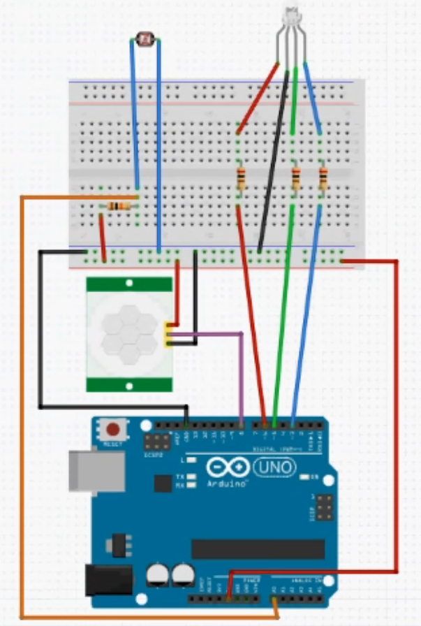

## 小夜灯案例

### 电路



光敏电阻+分压电阻（10K）检测环境亮度

红外感应模块感应人

### 程序

```c++
#define rLedPin 6
#define gLedPin 5
#define bLedPin 3
#define irSensorPin 8
#define lightSensorPin A0

int ledR=0;
int ledG=0;
int ledB=0;

bool irReading; // 红外感应模块输出
int lightReading; // 光敏电阻分压电路信号输出
int ledColorIndex;

void setup()
{
    pinMode(rLedPin,OUTPUT);
    pinMode(gLedPin,OUTPUT);
    pinMode(bLedPin,OUTPUT);
    pinMode(irSensorPin,INPUT);
    pinMode(lightSensorPin,INPUT);
}

void loop()
{
    lightReading=analogRead(lightSensorPin);
    delay(500);
    irReading=digitalRead(irSensorPin);
    delay(500);
    rgbTest();
}

void rgbTest()
{
    ...
}
```

2024.4.13