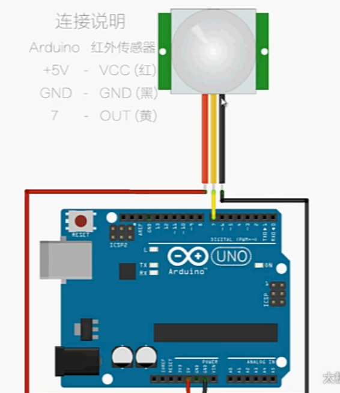
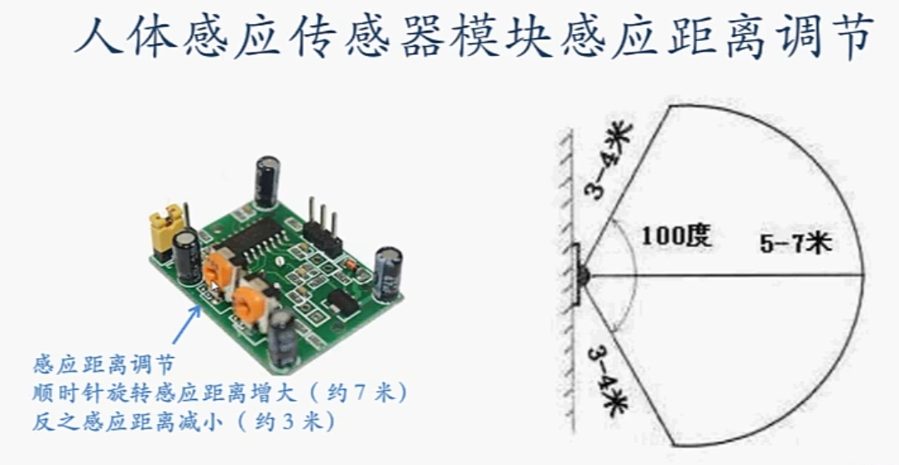

## 红外人体感应模块


感应人体产生的红外线信号


感应区域内红外线的**变化**

人呆在感应区里不会触发

探测到 有变化后 OUT 脚输出高电平，并保持一段时间


### 接线



### 代码

```c++
int irSensorPin=7;
bool isSensorOutput;

void setup()
{
    pinMode(irSensorPin,INPUT);
    Serial.begin(9600);
}

void loop()
{
    irSensorOutput=digitalRead(irSensorPin);

    if(irSensorOutput==HIGH)
    {
        Serial.println("person in");
    }
    else
    {
        Serial.println("person out");
    }
    delay(100);
}
```

### 调整探测范围




2024.4.11