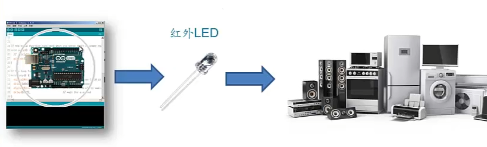

## 红外遥控

### 原理

红外LED发射信号，红外信号接收器接收信号

arduino可以装上红外LED当遥控器，也可以装上红外接收器当被操作的机器

### 红外接收器

可以将红外信号转换为电平信号

### 控制方式

### 通信协议

http://www.taichi-maker.com/homepage/reference-index/arduino-library-index/irremote-library/#ir-protocol

后续采用NEC协议

2024.4.13