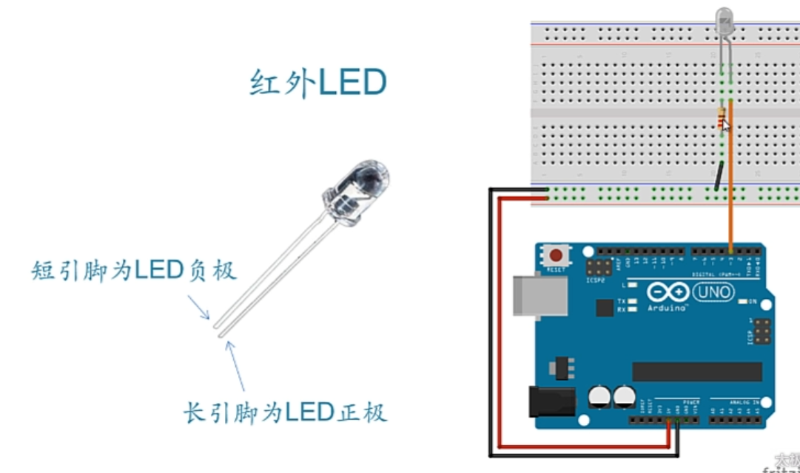
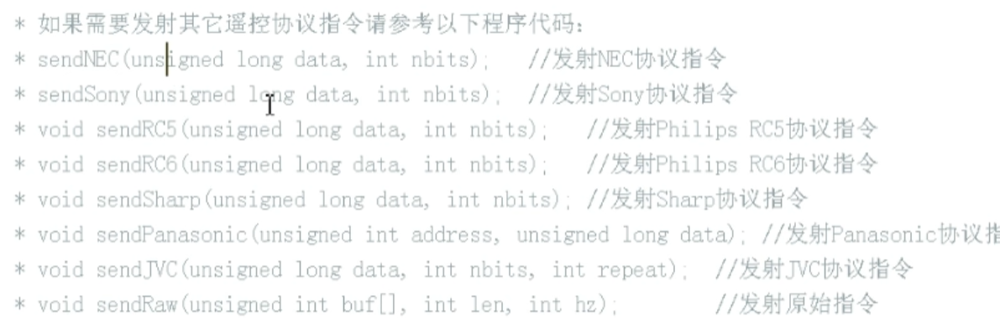
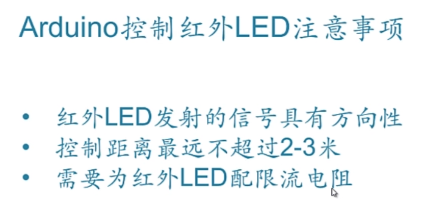

## 红外遥控-信号发送

### 红外LED



限流电阻100-200Ω即可

IRremote库默认用三号引脚进行遥控

### 程序

```c++
#include <IRremote.h>
IRsend irsend;

void setup()
{
}

void loop()
{
    for(int i=0;i<3;i++)
    {
        irsend.sendSony(0xa90,12); // 发送Sony协议A90指令码 12是指令信息位数
        // irsend.sendNec(0x7C03F,32);
        delay(40);
    }
    delay(5000);
}
```





2024.4.14