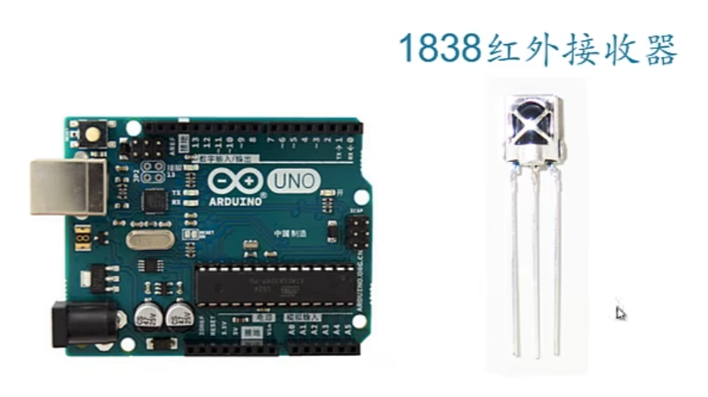
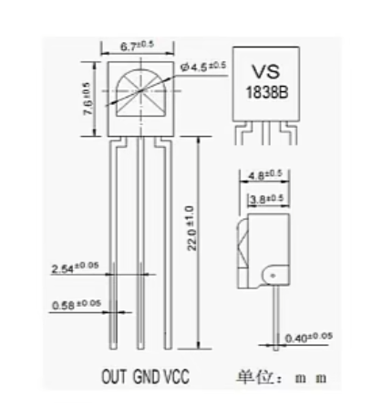
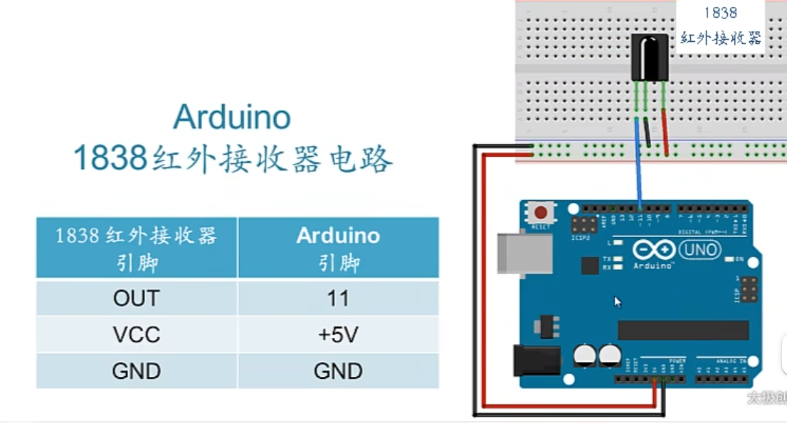
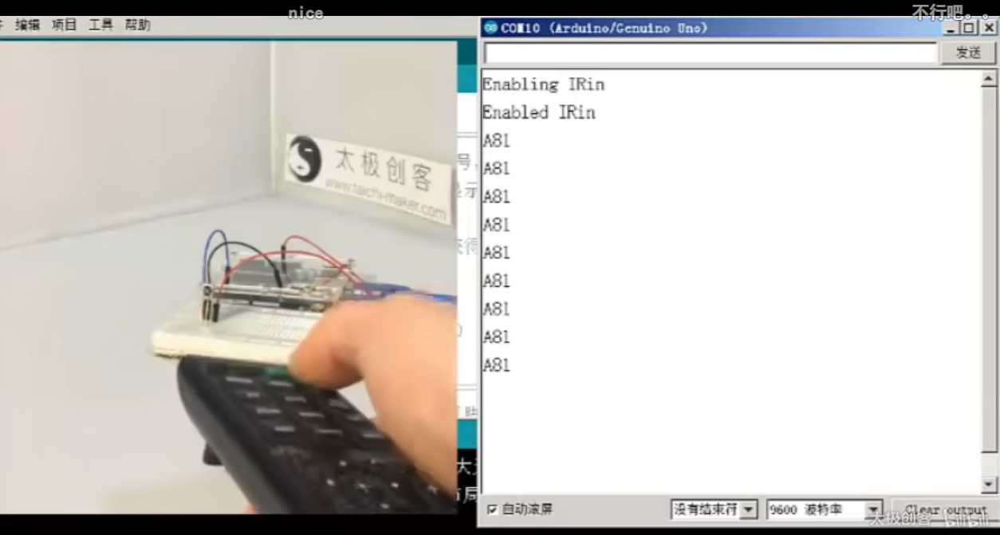
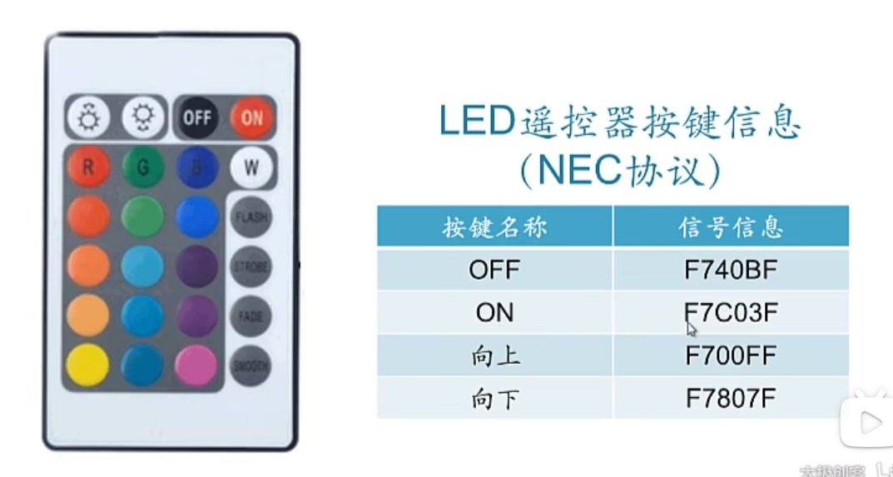

## 红外遥控信号接收



### 引脚分布



5V供电



### 程序

需要应用IRremote库

接收红外遥控器信号，并在串口中显示出来



```c++
#include <IRremote.h>
#define RECV_PIN 1

// irremote库固定格式
IRrecv irrecv(RECV_PIN); // 红外遥控初始化
decode_results results; // 储存接收到的红外遥控信息

void setup()
{
    Serial.begin(9600);
    Serial.println("Enabling IRin");
    irrecv.enableIRIn();
    Serial.println("Enabled IRin");
}

void loop()
{
    if(irrecv.decode(&results))
    {
        Serial.println(results.value,HEX);
        irrecv.resume(); // 恢复接收下一个红外信号
    }
    delay(100);
}
```



### 控制LED

```c++
#include <IRremote.h>
#define RECV_PIN 1

// irremote库固定格式
IRrecv irrecv(RECV_PIN); // 红外遥控初始化
decode_results results; // 储存接收到的红外遥控信息

void setup()
{
    pinMode(LED_BUILTIN,OUTPUT);
    digitalWrite(LED_BUILTIN,LOW);

    Serial.begin(9600);
    Serial.println("Enabling IRin");
    irrecv.enableIRIn();
    Serial.println("Enabled IRin");
}

void loop()
{
    if(irrecv.decode(&results))
    {
        Serial.println(results.value,HEX);

        if(reulsts.value==0xF7C03F)
        {
            Serial.println("Command Received: Turn on");
            digitalWrite(LED_BUILTIN,HIGH);
        }
        if(reulsts.value==0xF740BF)
        {
            Serial.println("Command Received: Turn off");
            digitalWrite(LED_BUILTIN,LOW);
        }

        irrecv.resume(); // 恢复接收下一个红外信号
    }
    delay(100);
}
```

2024.4.14