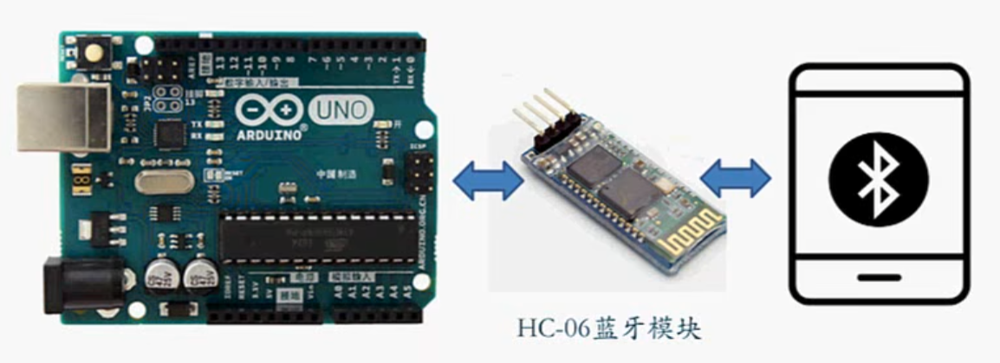
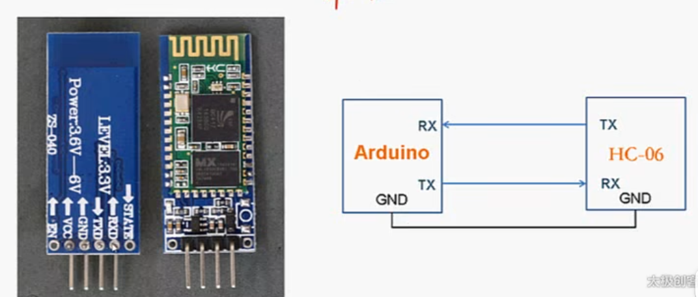
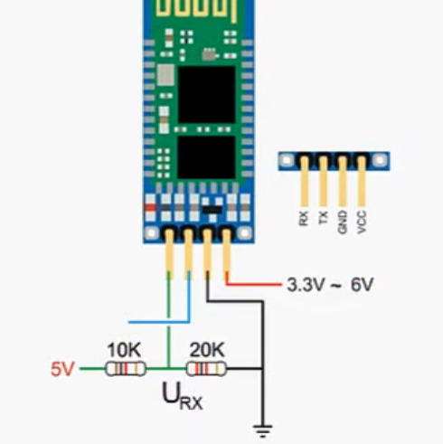
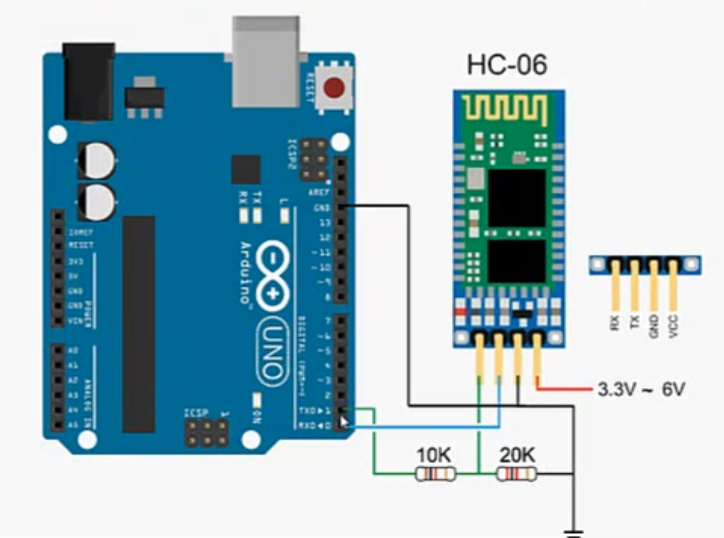

## HC06蓝牙模块



### 介绍

**HC06串口透传模块**

#### 串口

通过串口和arduino通信

需要共地!!



注意HC06串口高电平为3.3V，而arduino读取串口高电平为5V

需要通过分压电路进行降压



#### 透传

只是数据的搬运工，原封不动的将数据从手机通过蓝牙传输到arduino

### 接线



注意arduino的rx tx引脚连接后无法通过USB线传输数据（包括烧录代码），需要拔掉后操作

记得共地

### 通过HC06点亮LED

```c++
char serialData;

void setup()
{
    Serial.begin(9600);
    pinMode(11,OUTPUT); // 用来点亮LED
}

void loop()
{
    if(Serial.available()>0)
    {
        serialData=Serial.read();

        if(serialData=='1') // 点亮LED指令
        {
            digitalWrite(11,HIGH);
        }
        else // 熄灭LED
        {
            digitalWrite(11,LOW);
        }
    }
}
```

### 通信

可以通过 arduino bluetooth controller应用和手机进行通信

直接应用市场搜蓝牙调试应用均可

连接时默认配对密码是1234

2024.4.11