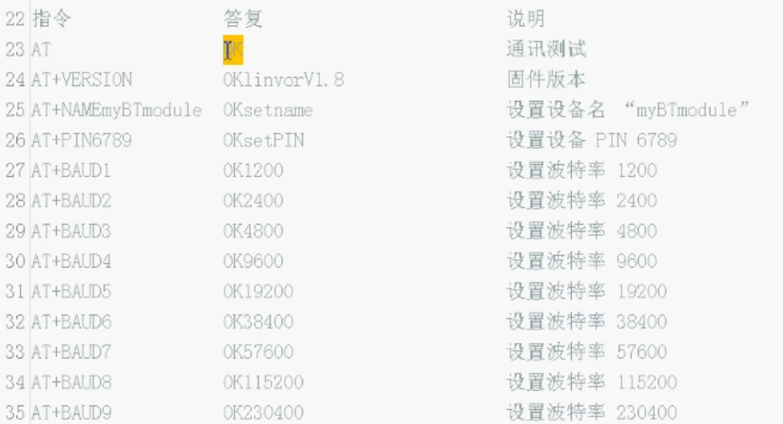
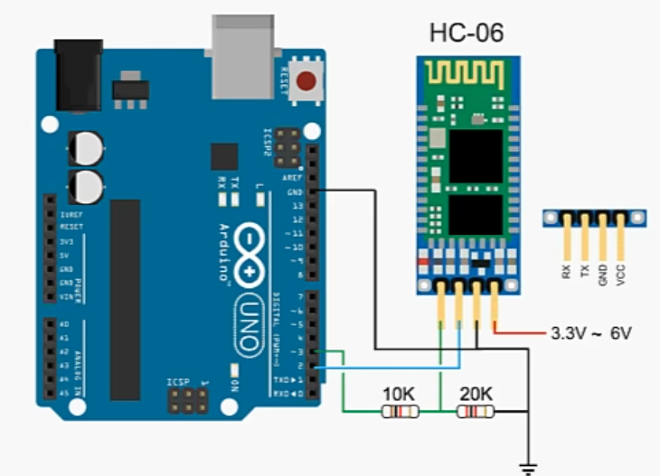

## HC06蓝牙通信模块

通过普通引脚传输数据

可以避免占用串口，并进行多个并行的通信

### HC06模块接收到信息后的操作

如果已经连接上设备

* 将数据原封不动地传递给设备

如果没有

* 先判断是不是给自己的AT指令

    * 可以设置PIN、蓝牙名称、波特率等

    * 注意修改之前务必记住改了什么，不然就找不回来了



### 接线



### 程序

```c++
#include <SoftwareSerial.h>

SoftwareSerial BTserial(2,3); // rx引脚2 tx引脚3

void setup()
{
    Serial.begin(9600);
    BTserial.begin(9600);

    Serial.print("HC06TEST");

    BTserial.print("AT"); // 发送AT指令，测试通信是否正常

    pinMode(11,OUTPUT);
}

void loop()
{
    // 通过串口监视HC-06发送的数据
    if(BTserial.available()>0)
    {
        char BTserialData=BTserial.read();
        Serial.print(BTserialData);
        if(BTserialData=='1')
        {
            digitalWrite(11,HIGH);
        }
        else if(BTserialData=='0')
        {
            digitalWrite(11,LOW);
        }
    }

    // 将用户通过串口监视器输入的数据发送给HD-06
    if(Serial.available()>0)
    {
        char serialData=Serial.read();
        BTserial.write(serialData);
    }
}
```