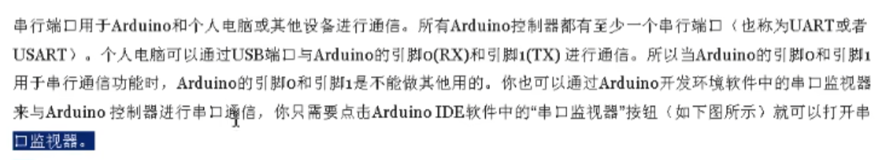
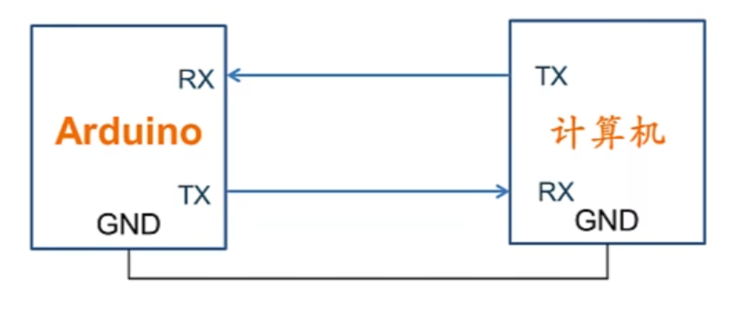
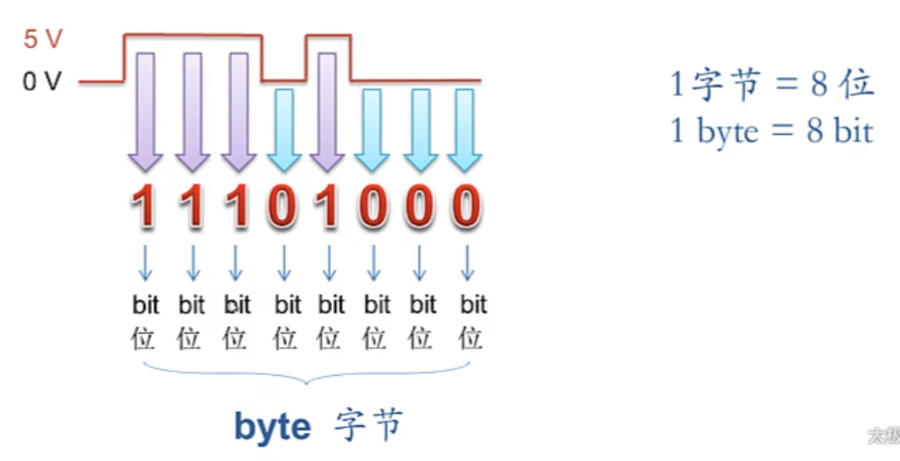
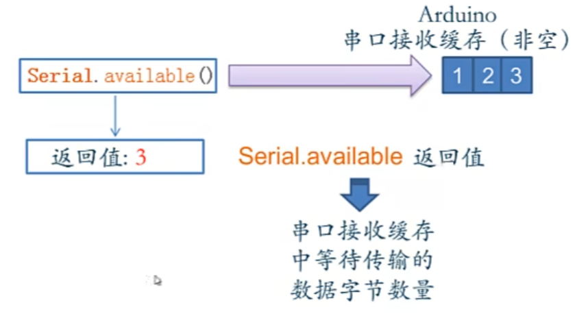
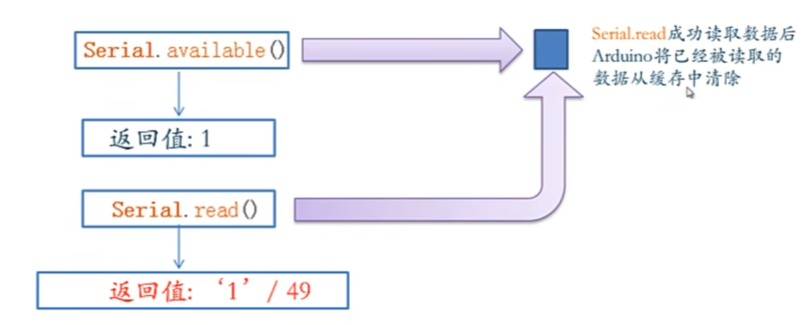
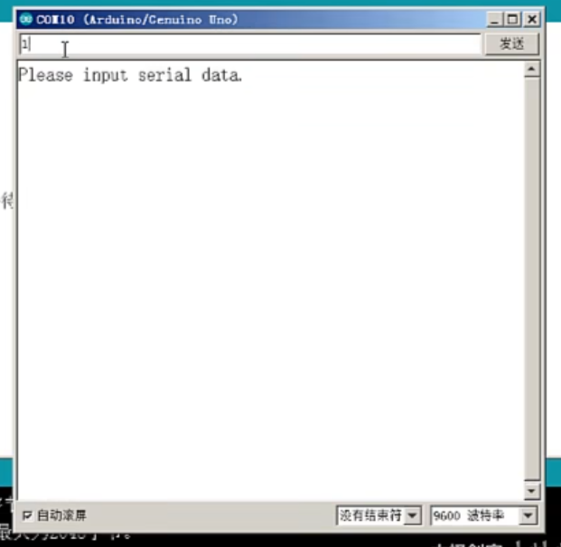

## 串口通信

arduino接受从电脑发送的数据



### RxTx引脚

Rx接收数据 Receive

Tx发送数据 Transmit

使用rx tx工作时，相应LED会闪烁

### 通讯



计算机的rx tx已经整合进USB接口

GND需要共地

用数据线连接电脑和arduino时已经共地了

### 串口数据

使用电压信号（高低电平）进行通信



每次arduino读取串口数据都是读取一个字节

* 每一位数据占有的时间，通过波特率来限定

    * ex:波特率9600→每秒传输9600位

### 数据接收流程

#### Serial.available()

arduino有一个串口数据**缓存区**

平时接收到的串口数据先在此存放

可以用 ```Serial.available()``` 来判断缓存区是否有数据

* 没有数据的话返回0，否则返回数据的字节数



#### Serial.read()

读取缓存区的数据



```Serial.read()```从缓存区读取一位数据，读取完毕后将这一位数据从缓存区清除

读不到数据返回-1

#### 例子

```c++
void setup()
{
    Serial.begin(9600);
    Serial.println("Please input serial data");
}

void loop()
{
    if(Serial.available()>0)
    {
        char serialData=Serial.read();
        Serial.println(serialData);
    }
}
```



##### char类型

用一个字节存储字符信息，ascii编码

2024.4.10