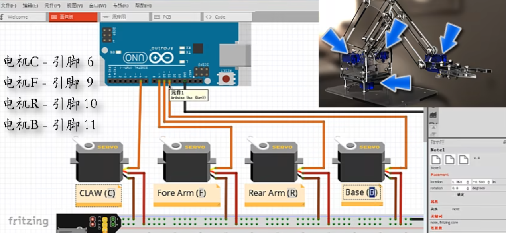
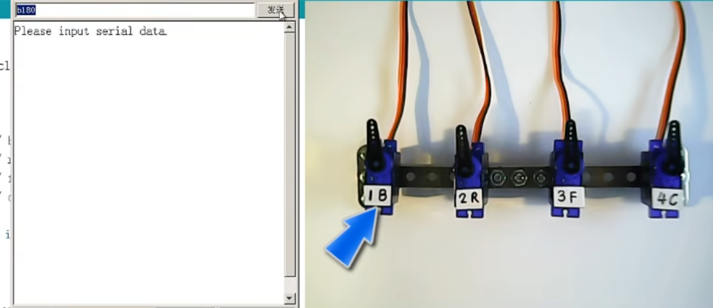

## 控制四个伺服电机



### 指令格式

```txt
b180
```

舵机编号+旋转角度



### 程序

```c++
#include <Servo.h>

Servo base,fArm,rArm,claw;

void setup()
{
    base.attach(11);
    rArm.attach(10);
    fArm.attach(9);
    claw.attach(6);

    Serial.begin(9600);
    Serial.println("Please input serial data");
}

void loop()
{
    if(Serial.available())
    {
        char servoName=Serial.read(); // 舵机编号

        Serial.print("servoName:");
        Serial.print(servoName);
        Serial.print(",");

        int data=Serial.parseInt(); // 角度信息

        switch(servoName)
        {
            case 'b':
                base.write(data);
                Serial.print("Set base servo value:");
                Serial.println(data);
                break;
            case 'r':
                rArm.write(data);
                Serial.print("Set rArm servo value:");
                Serial.println(data);
                break;
            case 'f':
                fArm.write(data);
                Serial.print("Set fArm servo value:");
                Serial.println(data);
                break;
            case 'c':
                claw.write(data);
                Serial.print("Set claw servo value:");
                Serial.println(data);
                break;
        }
    }
}
```

2024.4.10