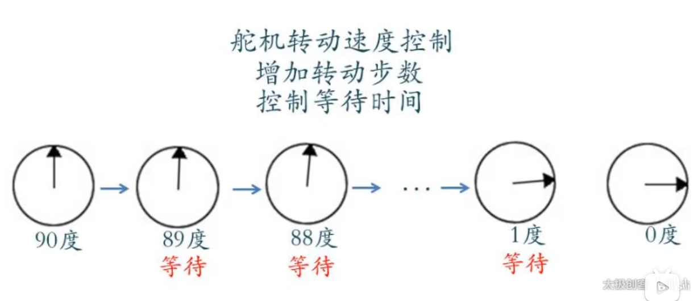

## 控制机械臂速度

### 原理



### 程序

改写上一节的armDataCmd函数

```c++
void armDataCmd(char serialCmd)
{
    Serial.print("serialCmd=");
    Serial.print(serialCmd);

    int fromPos;
    int toPos;

    int servoData=Serial.parseInt();
    switch(serialCmd)
    {
        case 'b':
            fromPos=base.read();
            toPos=servoData;

            if(fromPos<=toPos)
            {
                for(int i=fromPos;i<=toPos;i++)
                {
                    base.write(i);
                    delay(15);
                }
            }
            else
            {
                for(int i=fromPos;i>=toPos;i--)
                {
                    base.write(i);
                    delay(15);
                }
            }
            ...
    }
}
```

2024.4.10