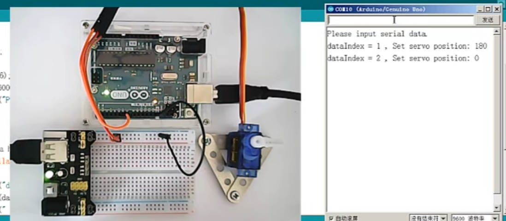
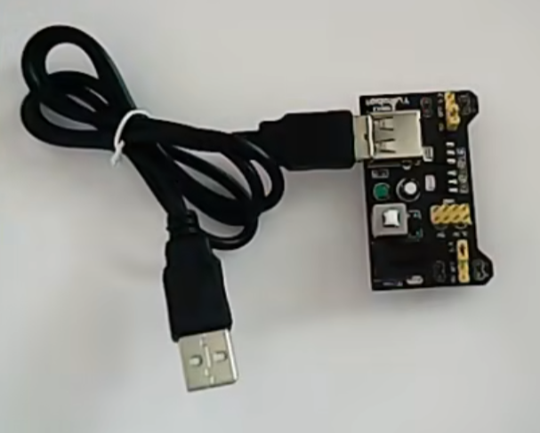
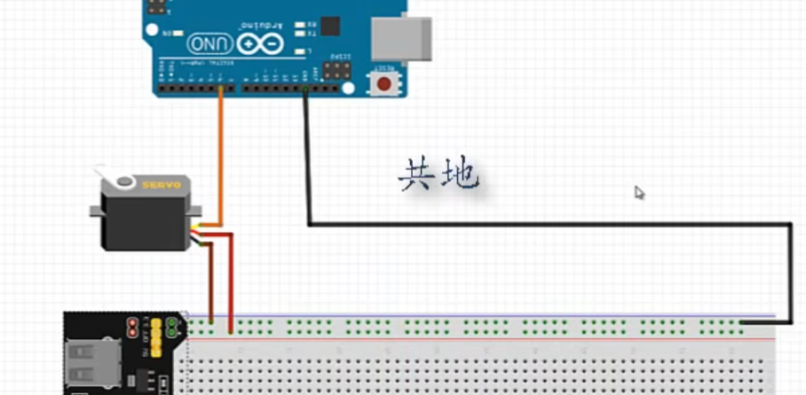

## 用串口控制舵机



### 电源模块



有两种电源输入端口，通过一个开关控制是否供电

反面有四个插针，刚好插到面包板上

有一个跳线，可以插到不同脚上，控制5V还是3.3V

不要带电作业！

### 接线



### 程序

```c++
#include <Servo.h>

Servo myServo;

int dataIndex=0;

void setup()
{
    myServo.attch(6);
    Serial.begin(9600);
    Serial.println("Please input serial data");
}

void loop()
{
    if(Serial.available()>0)
    {
        dataIndex++;
        Serial.print("dataIndex:");
        Serial.println(dataIndex);

        int pos=Serial.parseInt();
        Serial.print("pos value:");
        Serial.println(pos);

        myServo.write(pos);
        delay(15);
    }
}
```

通过 ```Serial.parseInt()``` 将char转换为int 

2024.4.10