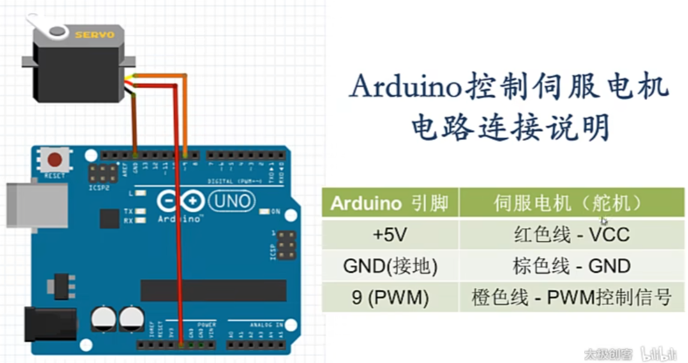

## 舵机

直流伺服电机

### 伺服的概念

servo

有一个闭环控制系统来控制旋转的角度


通过电位器（就是滑动变阻器）来读取转动的角度


### 如何通过arduino控制伺服电机



橙色的线需要连接到PWM输出 引脚

```c++
#include <Servo.h>

Servo myservo;

int pos=0;

void setup()
{
    myservo.attach(9);
    Serial.begin(9600);
}

void loop()
{
    for(pos=0;pos<=180;pos+=1>)
    {
        myservo.write(pos);
        Serial.println(pos);
        delay(15);
    }
    for(pos=180;pos>=0;pos-=1)
    {
        myservo.write(pos);
        Serial.println(pos);
        delay(15);
    }
}
```

2024.4.10