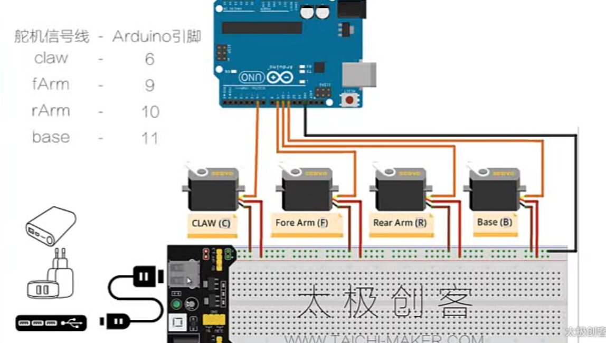

## 调试机械臂



### 程序

通过串口控制四个舵机的角度

ex:b45

```c++
#include <Servo.h>

Servo base,fArm,rArm,claw;

// 初始角度
int basePos=90;
int rArmPos=90;
int fArmPos=90;
int clawPos=90;

// 极限角度
const int baseMin=...;
const int baseMax=...;
const int rArmMin=...;
const int rArmMax=...;
const int fArmMin=...;
const int fArmMax=...;
const int clawMin=...;
const int clawMax=...;

void setup()
{
    base.attach(1);
    delay(200);
    rArm.attach(10);
    delay(200);
    fArm.attach(9);
    delay(200);
    claw.attach(6);
    delay(200);

    Serial.begin(9600);
}

void loop()
{
    if(Serial.available()>0)
    {
        char serialCmd=Serial.read();
        armDataCmd(serialCmd);
    }

    base.write(basePos);
    delay(10);
    fArm.write(fArmPos);
    delay(10);
    rArm.write(rArmPos);
    delay(10);
    claw.write(clawPos);
    delay(10);
}

void armDataCmd(char serialCmd)
{
    Serial.print("serialCmd=");
    Serial.print(serialCmd);

    int servoData=Serial.parseInt();
    switch(serialCmd)
    {
        case 'b':
            basPos=servoData;
            Serial.print(" Set base servo value:");
            Serial.println(servoData);
            break;
        case 'c':
            clawPos=servoData;
            Serial.print(" Set claw servo value:");
            Serial.println(servoData);
            break;
        case 'r':
            rArmPos=servoData;
            Serial.print(" Set rArm servo value:");
            Serial.println(servoData);
            break;
        case 'f':
            fArmPos=servoData;
            Serial.print(" Set fArm servo value:");
            Serial.println(servoData);
            break;
        case 'o':
            reportStatus();
            break;
        default:
            Serial.println("Unknow Command");
    }
}
```

2024.4.10