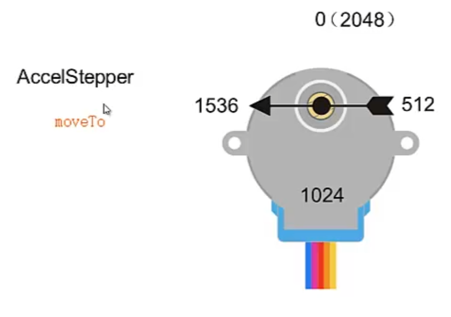
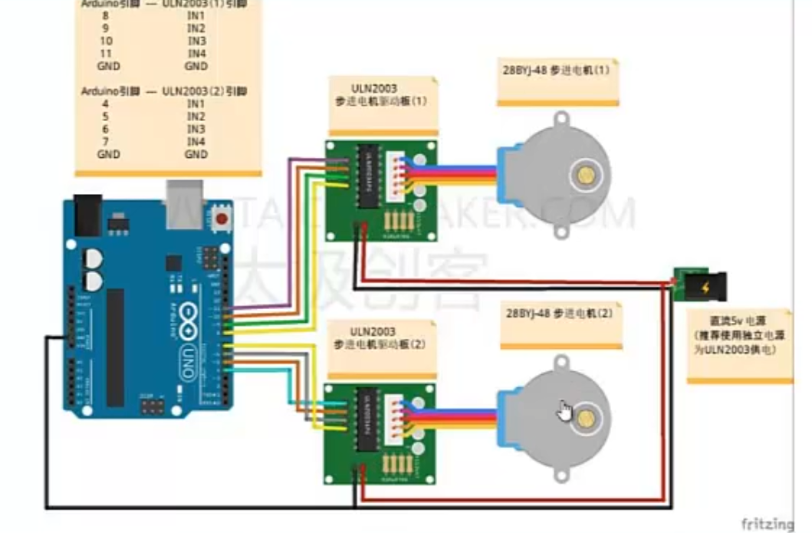

## AccelStepper步进电机库

也可以用来控制28YBJ-48步进电机

外部输出轴旋转一周，走2048步

### 输出轴位置坐标



通过 ```moveTo``` 函数实现移动到指定位置

当处于半步进状态时，```moveTo``` 转动的角度也会小一半

### 控制两个步进电机

#### 电路



* 8 9 10 11 , 4 5 6 7分别连接到两个ULN2003驱动板

* 为两个驱动板单独供电

* 记得共地

#### 程序

```c++
#include <AccelStepper.h>

#define FULLSTEP 4 // 全步进参数
#define HALFSTEP 8 // 半步进参数

// 步进电机引脚
#define motor1Pin1 8
#define motor1Pin2 9
#define motor1Pin3 10
#define motor1Pin4 11

#define motor2Pin1 4
#define motor2Pin2 5
#define motor2Pin3 6
#define motor2Pin4 7

// 定义两个步进电机对象
// 1号半步进运行 2号全步进运行
AccelStepper stepper1(HALFSTEP,motor1Pin1,motor1Pin3,motor1Pin2,motor1Pin4);
AccelStepper stepper2(FULLSTEP,motor2Pin1,motor2Pin3,motor2Pin2,motor2Pin4);

void setup()
{
    stepper1.setMaxSpeed(500.0);
    stepper1.setAcceleration(50.0);

    stepper2.setMaxSpeed(500.0);
    stepper2.setAcceleration(50.0);
}

void loop()
{
    if(stepper1.currentPosition()==0 && stepper2.currentPosition()==0)
    {
        // 1号电机旋转半周
        stepper1.moveTo(2048);
        stepper2.moveTo(2048);
    }
    else if(stepper1.currentPosition()==2048 && stepper2.currentPosition()==2048)
    {
        stepper1.moveTo(0);
        stepper2.moveTo(0);
    }

    stepper1.run();
    stepper2.run();
}
```

#### currentPosition

当舵机通上电的那一刻，它的原始位置就是 0

跟舵机不同，步进电机会丢步

#### stepper.moveTo

这个函数是异步执行的，不会卡在这一行

2024.4.17