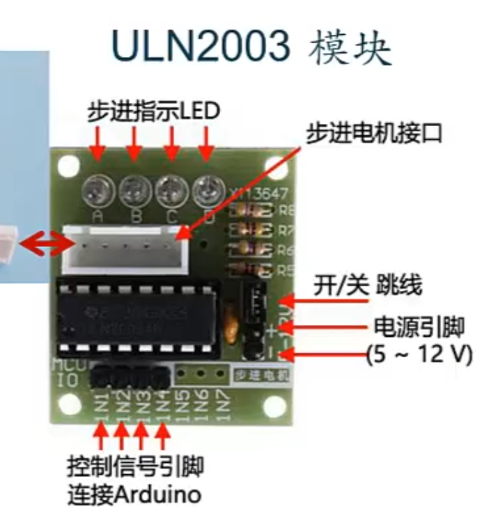

## 控制28BYJ-48步进电机


### 介绍

这种步进电机可以和stepper库配合使用进行快捷地控制

http://www.taichi-maker.com/homepage/reference-index/arduino-library-index/stepper-library/


注意这是一种减速电机，减速比1:64


步进角度为11.25°（转子选准一周要走32步）

经过减速（输出轴转一圈需要转子旋转64度）

输出轴转一周需要2048步

### LUN2003电机驱动板


开关跳线需要用导线互相连接短路后，驱动板才能正常工作，否则处于关闭状态




### 程序

stepper库是一个arduino的自带库，不需要安装

```c++
#include <Stepper.h>

// 电机旋转一周的步数
const int STEPS_PER_ROTOR_REV=32;

// 减速比
const int GEAR_REDUCTION=64;

// 电机外部轴旋转一周的步数
const float STEPS_PER_OUT_REV=STEPS_PER_ROTOR_REV*GEAR_REDUCTION;

// 建立电机对象
// ULN2003驱动板的In1 In3 In2 In4引脚（注意顺序）
Stepper stepperMotor(STEPS_PRE_ROTOR_REV,8,10,9,11);

void setup()
{}

void loop()
{
    // 极慢的速度旋转4步
    stepperMotor.setSpeed(1);
    StepsRequired=4;
    steppermotor.step(StepsRequired);
    delay(1000);

    // 慢速顺时针旋转一圈
    StepsRequired=STEP_PRE_OUT_REV;
    stepMotor.setSpeed(500);
    stepperMotor.step(StepsRequired);
    delay(1000);
     
    // 快速逆时针转一圈
    StepsRequired=-STEPS_PRE_OUT_REV;
    stepMotor.setSpeed(800);
    stepMotor.step(StepsRequired);
    delay(2000);
}
```

注意当程序执行到 ```stepMotor.step(xxx)``` 时会被阻塞，这行执行完毕后才会往下执行

因此 stepper 这个库只能同时控制一个电机

2024.4.16