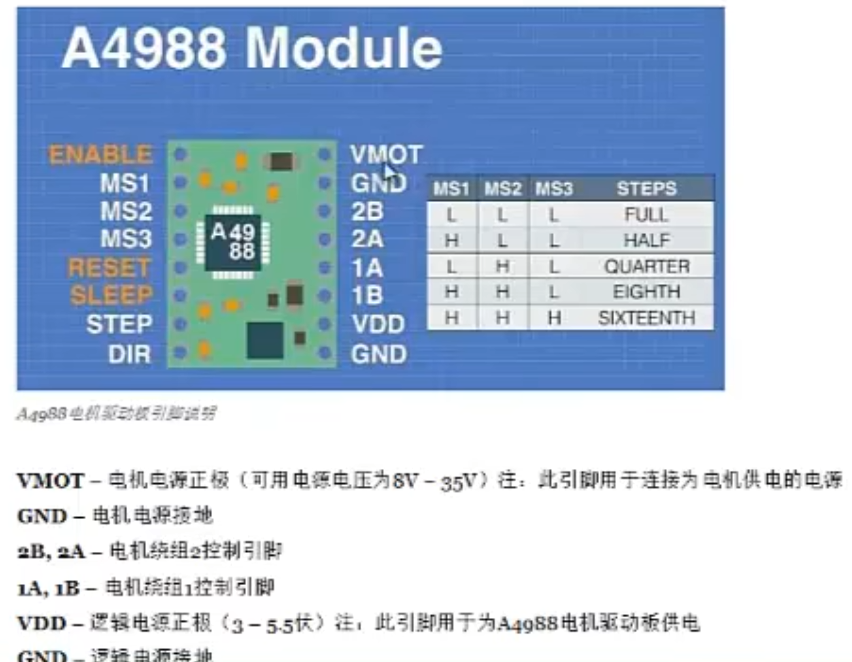

## arduino控制42步进电机-上


### 概念

NEMA:符合NEMA标准的步进电机

NEMA17:电机的机座尺寸是1.7英寸（43毫米）


### A4988电机驱动板

哪些电机可以用A4988控制



VMOT GND 用来给电机供电

VDD GND 用来给A4988模块供电

通过MS1 MS2 MS3三个引脚的电平状态来确定工作模式（见图里的表格）（全步进，半步进...）

* STEP 引脚通过arduino输入脉冲信号，脉冲一次走一步

* DIR 通过高低电平决定转动方向

* SLEEP 引脚决定模块是否处于睡眠状态，处于高电平模式时不睡眠

* RESET 用来复位，默认输出高电平，可以直接连接到SLEEP保持唤醒

* ENABLE 使能引脚，通入高电平关闭

### 基础电路


默认全步进控制

电容用于保护A4988模块，注意电容引脚有正负之分，不要接反

注意要先对模块进行**调节**不然会烧坏电机

调节方法：

http://www.taichi-maker.com/homepage/reference-index/motor-reference-index/arduino-a4988-nema-stepper-motor/#function

### 程序

```c++
const int dirPin=2;
const int stepPin=3;

const int STEPS_PER_REV=200; // 电机每圈步数
// 1.8°旋转一周要走200步

void setup()
{
    pinMode(stepPin,OUTPUT);
    pinMode(dirPin,OUTPUT);
}

void loop()
{
    // 设置电机顺时针旋转
    digitalWrite(dirPin,LOW);

    // 电机慢速旋转
    for(int x=0;x<STEP_PRE_REV;x++)
    {
        digitalWrite(stepPin,HIGH);
        delayMicroseconds(2000); // 2000微秒
        digitalWrite(stepPin,LOW);
        delayMicroseconds(2000);
    }

    delay(1000);

    // 设置电机逆时针旋转
    digitalWrite(dirPin,HIGH);

    // 电机慢速旋转
    for(int x=0;x<(STEP_PRE_REV*2);x++)
    {
        digitalWrite(stepPin,HIGH);
        delayMicroseconds(1000);
        digitalWrite(stepPin,LOW);
        delayMicroseconds(1000);
    }

    delay(1000);
}
```

2024.4.15