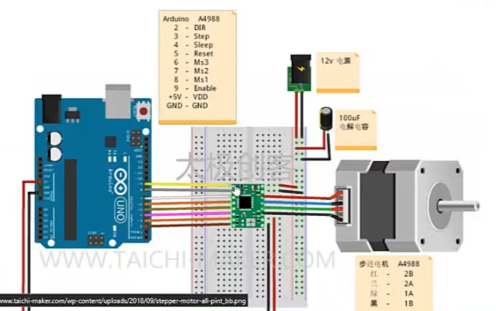
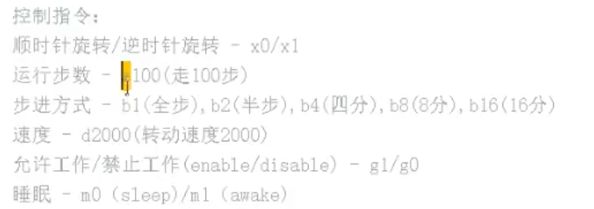

## 控制步进电机



### 指令



### 代码

```c++
// A4988引脚
const int dirPin=2;
const int stepPin=3;
const int sleepPin=4;
const int resetPin=5;
const int ms3Pin=6;
const int ms2Pin=7;
const int ms1Pin=8;
const int enPin=9; //enable

// 步进电机一周旋转步数
const int STEPS_PER_REV=200;

// 用户指令字符
char cmd;

// 用户指令数据
int data;

// 步进方式
int stepMode=1;

// 电机转速
int motorSpeed=2000;

void setup()
{
    // 设置引脚模式
    pinMode(stepPin,OUTPUT);
    pinMode(dirPin,OUTPUT);
    pinMode(sleepPin,OUTPUT);
    pinMode(resetPin,OUTPUT);
    pinMode(ms3Pin,OUTPUT);
    pinMode(ms2Pin,OUTPUT);
    pinMode(ms1Pin,OUTPUT);
    pinMode(enPin,OUTPUT);

    // 初始化引脚状态
    digitalWrite(sleepPin,HIGH);
    digitalWrite(resetPin,HIGH);
    digitalWrite(enPin,LOW);

    // 初始化电机模式为全步进
    digitalWrite(ms1Pin,LOW);
    digitalWrite(ms2Pin,LOW);
    digitalWrite(ms3Pin,LOW);

    Serial.begin(9600);
    Serial.println("Motor Test");
}

void loop()
{
    if(Serial.available())
    {
        cmd=Serial.read();
        Serial.print("cmd = ");
        Serial.print(cmd);
        Serial.print(" , ");

        data=Serial.parseInt();
        Serial.print("data = ");
        Serial.print(data);
        Serial.println("");

        runUserCmd();
    }
}

void runUserCmd()
{
    switch(cmd)
    {
        case 'x':
            Serial.print("set rotation to ");
            if(data==0)
            {
                digitalWrite(dirPin,0);
                Serial.println("clockwise");
            }
            else
            {
                digitalWrite(dirPin,1);
                Serial.println("counter clockwise");
            }
            break;

        case 'g':
            Serial.print("set motor to ");
            if(data==0)
            {
                digitalWrite(enPin,1);
                Serial.println("disable");
            }
            else
            {
                digitalWrite(enPin,0);
                Serial.println("enable");
            }
            break;

        case 'm':
            Serial.print("set motor to ");
            if(data==0)
            {
                digitalWrite(sleepPin,0);
                Serial.println("sleep");
            }
            else
            {
                digitalWrite(sleepPin,1);
                Serial.println("awake");
            }
            break;

        case 'b':
            if(data==1 || data==2 || data==4 || data==8 || data==16)
            {
                Serial.print("set motor step control to ");
                setStepMode(data);
            }
            else
            {
                Serial.println("wrong step mode cmd");
            }
            break;

        case 'z':
            Serial.print("motor go ");
            Serial.print(data);
            Serial.println(" steps");

            runStepper(motorSpeed,data);
            break;

        case 'd':
            motorSpeed=data;
            Serial.print("set motor speed to ");
            Serial.println(data);
            break;

        default:
            Serial.println("Unknown cmd");
    }
}

// 运行步进电机
void runStepper(int rotationSpeed,int stepNum)
{
    for(int x=0;x<stepPin;x++)
    {
        digitalWrite(stepPin,HIGH);
        delayMicroseconds(rotationSpeed);
        digitalWrite(stepPin,LOW);
        delayMicroseconds(rotationSpeed);
    }
}

...
```

2024.4.16