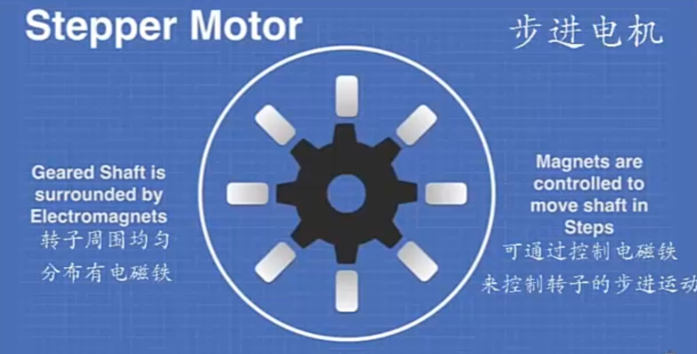
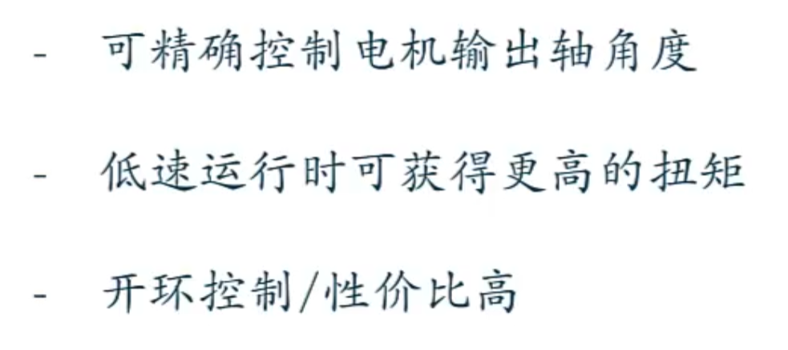
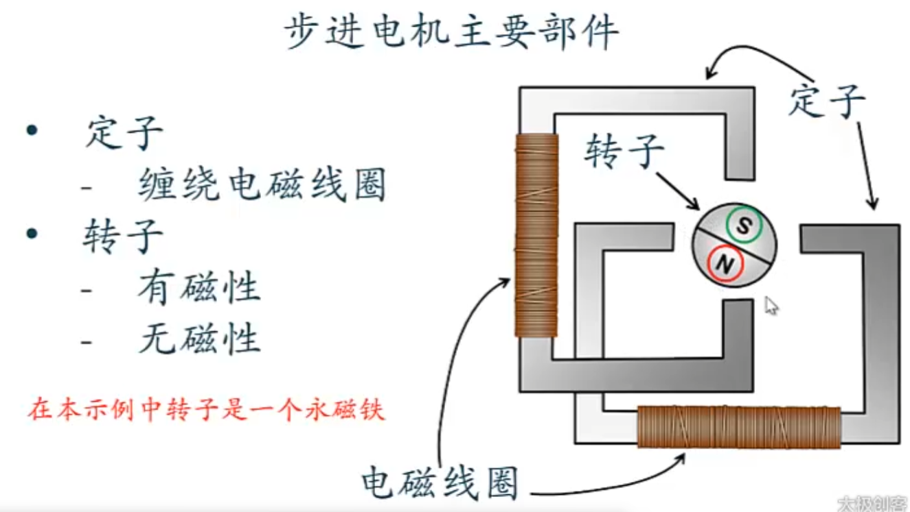
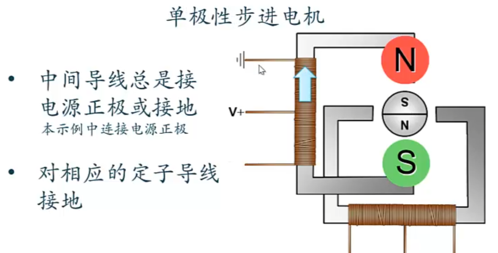
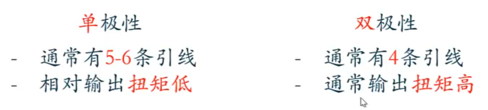
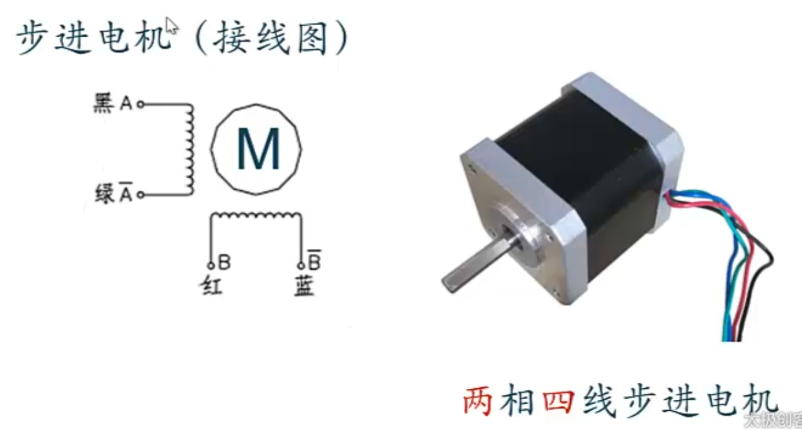
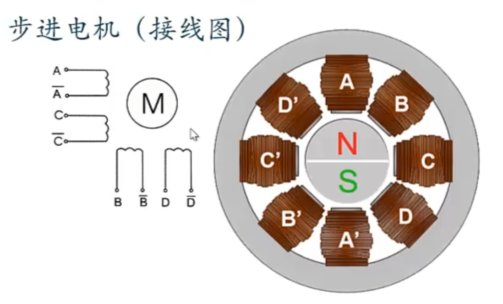
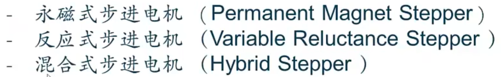
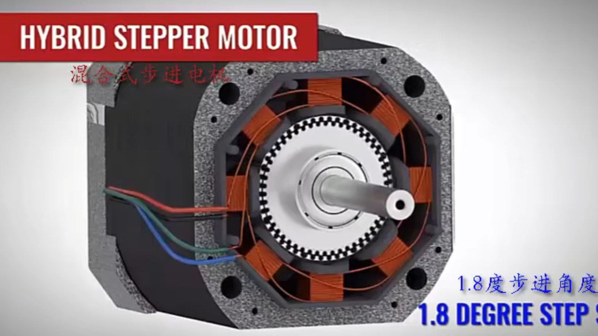

## 步进电机原理

### 概念

一步一步转动

#### 优点

#### 原理

### 分类

#### 根据独立线圈数量

* 双极性步进电机

    * 本节所有电机都是双极性步进电机

* 单极性步进电机

    

### 基本参数

* 定位扭矩 ： 电机不通电时，转子自身的锁定力矩

* 保持转矩 ： 电机通电但不转动时，定子锁定转子的力矩

* 相数 ： 可独立通电的定子电磁线圈数    

    * 通过接线图来确定

    

    

#### 根据内部磁体类型

##### 混合式步进电机

步进角度一般为1.8°，半步进0.9°

2024.4.15